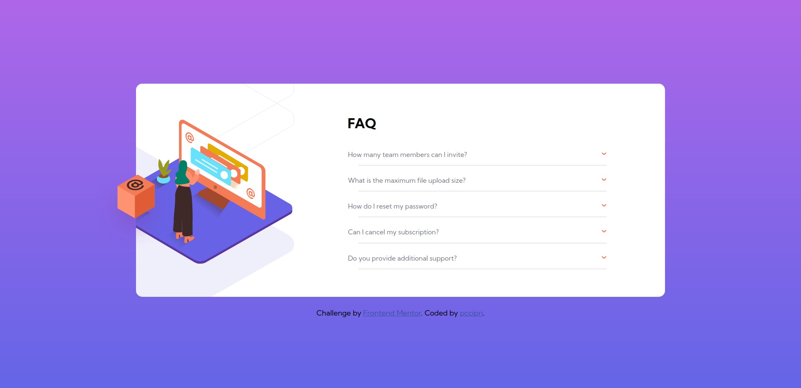

# Frontend Mentor - FAQ accordion card solution

This is a solution to the [FAQ accordion card challenge on Frontend Mentor](https://www.frontendmentor.io/challenges/faq-accordion-card-XlyjD0Oam). Frontend Mentor challenges help you improve your coding skills by building realistic projects. 

## Table of contents

- [Overview](#overview)
  - [The challenge](#the-challenge)
  - [Screenshot](#screenshot)
- [My process](#my-process)
  - [Built with](#built-with)
  - [What I learned](#what-i-learned)
  - [Useful resources](#useful-resources)
- [Author](#author)

## Overview

### The challenge

Users should be able to:

- View the optimal layout for the component depending on their device's screen size
- See hover states for all interactive elements on the page
- Hide/Show the answer to a question when the question is clicked

### Screenshot

## My process

### Built with

- Semantic HTML5 markup
- CSS custom properties
- Flexbox
- CSS Grid
- Mobile-first workflow

**Note: These are just examples. Delete this note and replace the list above with your own choices**

### What I learned

  - How to make a accordion
  - Improved my positioning skills

### Useful resources

- [Container extend as much as the image](https://stackoverflow.com/questions/600743/how-to-get-div-height-to-auto-adjust-to-background-size) - Helped to make images the right size.
- [Css Accordion](https://www.youtube.com/watch?v=pzy_QStQaqA&t=811s&ab_channel=dcode) - This video helped me learn about the accordion and how to make one.

## Author

- Frontend Mentor - [@pccipri](https://www.frontendmentor.io/profile/pccipri)
