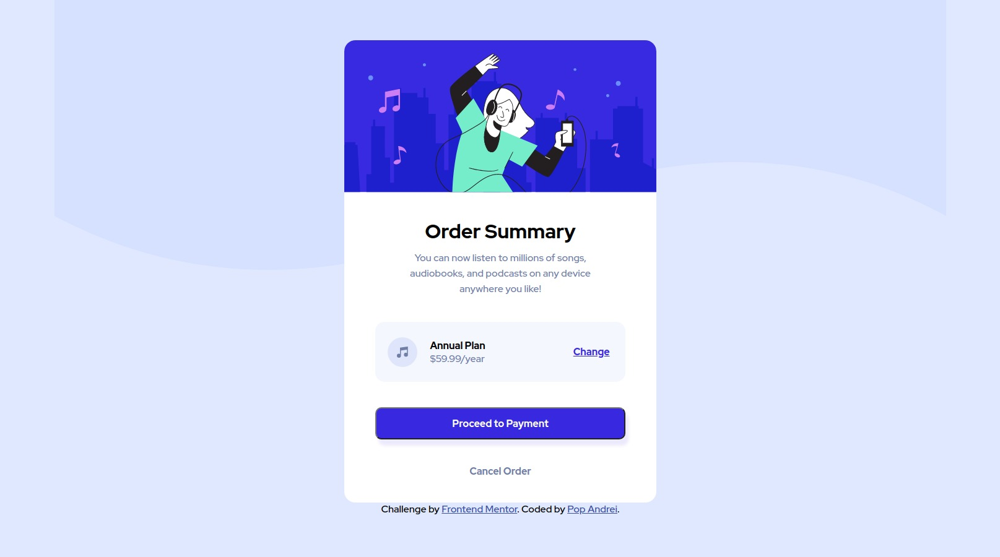

# Frontend Mentor - Order summary card solution

This is a solution to the [Order summary card challenge on Frontend Mentor](https://www.frontendmentor.io/challenges/order-summary-component-QlPmajDUj). Frontend Mentor challenges help you improve your coding skills by building realistic projects. 

## Table of contents

- [The challenge](#the-challenge)
- [Screenshot](#screenshot)
- [Built with](#built-with)
- [Useful resources](#useful-resources)
- [Author](#author)

### The challenge

Users should be able to:

- See hover states for interactive elements

### Screenshot

### Built with
- CSS Pseudo-classes
- Semantic HTML5 markup
- CSS Flexbox

### Useful resources

- [CSS Tricks - Flexbox](https://css-tricks.com/snippets/css/a-guide-to-flexbox/) - This helped consolidate my knowledge on flexbox and i recommend this website to anyone who need's to learn or look up this subject.

### Author

- Frontend Mentor - [@pccipru](https://www.frontendmentor.io/profile/pccipru)
